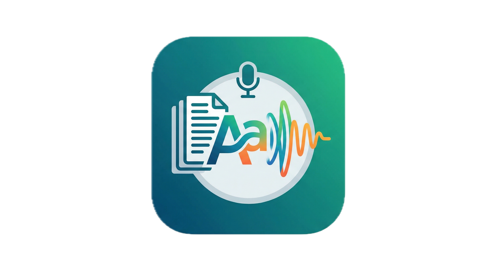

<p align="center">
  
</p>

<h1 align="center">🎙 Text to MP3</h1>

<p align="center">
  テキストを高品質な音声MP3に変換するローカルWebアプリ
</p>

---

## 特徴

- **3つの入力方法**: コピー&ペースト / ファイルアップロード / URL自動抽出
- **2つのTTSプロバイダー**: OpenAI（簡単・有料）/ Google Cloud（高音質・月100万文字無料）
- **APIキーはローカル保存**: 外部送信なし、自分のPCにだけ保存
- **長文対応**: 自動でチャンク分割し、シームレスに結合
- **日本語最適化**: HTMLの折り返し改行や装飾文字を自動修復
- **macOSはダブルクリックで起動**: `start.command` で簡単起動

---

## クイックスタート

詳しいセットアップは [`SETUP.md`](SETUP.md) を参照してください。最短手順:

```bash
git clone https://github.com/tomhero916/text-to-mp3.git
cd text-to-mp3
python3 -m venv venv
source venv/bin/activate
pip install -r requirements.txt
brew install ffmpeg     # macOS（未インストールの場合）
streamlit run app.py
```

ブラウザが自動で開きます。サイドバーで OpenAI APIキー（または Google Cloud 認証情報）を設定すれば、すぐに使えます。

---

## 🚀 macOSでの簡単起動（start.command）

初回セットアップ後は、`start.command` をダブルクリックするだけでアプリを起動できます。

### 使い方

1. Finderで `text-to-mp3` フォルダを開く
2. `start.command` をダブルクリック
3. ターミナルが起動し、自動的に仮想環境が有効化されてアプリが立ち上がります
4. ブラウザが自動で開いてアプリが表示されます

### 初回起動時の注意

macOSのセキュリティ機能により、初回起動時に「開発元を検証できません」という警告が表示されることがあります。その場合:

1. `start.command` を **右クリック → 開く**
2. 表示されるダイアログで「開く」をクリック

これで以降は通常のダブルクリックで起動できます。

### Dockに登録する

毎回Finderから探すのが面倒な場合:

1. `start.command` を Finder で右クリック →「エイリアスを作成」
2. 作成されたエイリアスを Dock の右端（区切り線の右側）にドラッグ

これで Dock からワンクリックで起動できます。

### アイコンを変更する

`start.command` のアイコンを変更したい場合:

1. `icon.png` を開いて全体を選択 → コピー（⌘C）
2. `start.command` を選択 → ⌘+I（情報を見る）
3. 左上のアイコンをクリック → ⌘V でペースト

---

## ファイル構成

```
text-to-mp3/
├── app.py              # Streamlitメインアプリ
├── tts_providers.py    # OpenAI/Google両対応のTTSロジック
├── text_extractors.py  # URL本文抽出・ファイル読み込み
├── requirements.txt    # 依存ライブラリ
├── start.command       # macOS用ワンクリック起動スクリプト
├── icon.png            # アプリアイコン
├── README.md           # このファイル
├── SETUP.md            # 詳細セットアップガイド
└── LICENSE             # MITライセンス
```

---

## 料金の目安

| プロバイダー | 料金 | メルマガ1本（3万文字） |
|---|---|---|
| OpenAI gpt-4o-mini-tts | 1000文字あたり約$0.015 | 約60円 |
| OpenAI tts-1 | 1000文字あたり約$0.015 | 約60円 |
| OpenAI tts-1-hd | 1000文字あたり約$0.030 | 約120円 |
| Google Cloud Chirp 3 HD | **月100万文字まで無料** | **無料** |

日本語品質を重視するなら、**Google Cloud Chirp 3 HD** が最もおすすめです。

---

## システム要件

- macOS / Windows / Linux
- Python 3.10 以上
- ffmpeg（音声処理用）

---

## ライセンス

[MIT License](LICENSE) - 自由に使用・改変・再配布できます。
